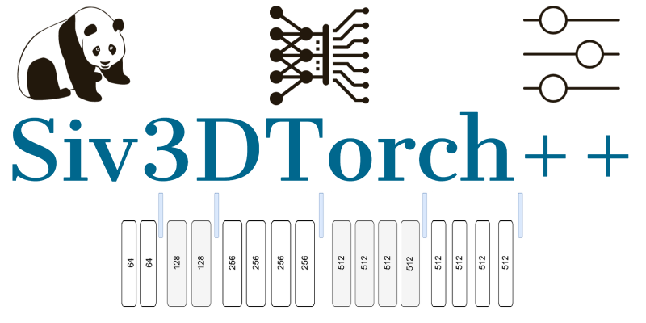

<h1 align="center">  
  </a>
</h1>

<h4 align="center">An integration of the Siv3D C++ framework with the Libtorch C++ Deep Learning Library</h4>
      
<p align="center">
  <a href="#about">About</a> •
  <a href="#installation">Installation</a> •  
  <a href="#features">Features</a> •  
  <a href="#author">Author</a> •  
  <a href="#license">License</a>
</p>

---

## About

<table>
<tr>
<td>
  
**Siv3DTorch++** is an **integration** of the well-known Japanese **_OpenSiv3D_** (https://github.com/Siv3D/OpenSiv3D) creative coding library (https://siv3d.github.io/) and my favourite Deep Learning Library Libtorch: the **_PyTorch_** C++ frontend.

Unfortunately, though I wanted to use **CMake**, and most users of Libtorch I know of use CMake in thier projects (https://github.com/prabhuomkar/pytorch-cpp), 
at the moment Siv3D does not support it and therefore I had to setup everything as a **VC 19** project which was not very easy.
Moreover, Siv3D is a std++latest project while Libtorch is a std++17 project and therefore initially, 
I could not compile the project until the great authors os Siv3D provides a simple solution (https://github.com/Siv3D/OpenSiv3D/issues/532).  
 
By including a single header file, `#include <torch/script.h>` The integration allows one to easily use any API from the PyTorch C++ front-end and use it fro creative coding.  
 


<p align="right">
<sub>(Preview)</sub>
</p>

</td>
</tr>
</table>

## Credits 
* A C++17/C++20 framework for creative coding https://github.com/Siv3D/OpenSiv3D, for 日本語: https://siv3d.github.io/ja-jp/, for English: https://siv3d.github.io/. 

## A simple example 
The folowing example allocates a PyTorch style random tensor on the GPU ( a CPU is also supported of course), applies the sigmoid to it, then detaches the tensor from 
the GPU and uses the result to display on a Siv3D window.
 
```cpp
torch::Tensor sigmoid001(const torch::Tensor & x ){
    torch::Tensor sig = 1.0 / (1.0 + torch::exp(( -x)));
    return sig;
}
```
Full source code:

```cpp
# include <Siv3D.hpp>
#include <torch/script.h>
#include <vector>
#include <typeinfo> 

torch::Tensor sigmoid001(const torch::Tensor& x) {	
	torch::Tensor sig = 1.0 / (1.0 + torch::exp((-x)));
	return sig;
}


torch::Device device(torch::kCUDA);
torch::Tensor tensor = torch::eye(3).to(device);

void Main()
{
	Window::SetTitle(U"TorchSiv3D C++");
	const Texture icn0(Emoji(U"✡"));
	icn0.draw(0, 0);				
	Scene::SetBackground(Color(87, 83, 95));					
					
	while (System::Update())
	{	
		for (auto i : Range(1, 20))
		{
			//ClearPrint();			
			//torch::Tensor t0 = torch::tensor((i)).to(device);
			torch::Tensor t0 = torch::rand(1).to(device); // Allocate a tensor on the GPU
			t0 = sigmoid001(t0);
			//Print (typeid(t0).name());		
			auto x = (t0).data().detach().item().toFloat(); // Move it to teh CPU
			Print(x); //Use it from Siv3D			
			Circle(300 * (x), 300*x, 50*x).draw((ColorF(0.5 *x, 0.9*x, 0.3*x)));
		}		
	}
}
```

## Features

|                            | 🔰 Siv3DTorch++ VC 19  | ◾ CMake |
| -------------------------- | :----------------: | :-------------: |
| PyTorch CPU tensors        |         ✔️         |        ❌        |
| PyTorch GPU tensors        |         ✔️         |        ❌        |
| Libtorch C++ 1.6           |         ✔️         |        ❌        |


## Installation
## Requirements:
* Windows 10 and Microsoft Visual C++ 2019 16.4, Linux is not supported at the moment because of the lack of CMake support.
* NVIDIA CUDA 10.2. I did not test with any other CUDA version. 
* PyTorch / LibTorch c++ version 1.6.  
* 64 bit only.  

##### Downloading and installing steps:
* **[Download]()** the latest version of Siv3D.
* **Go** to the following path: `\...\Steam\userdata\<Your_SteamID3>\730\local\`
  * See below **[how to find your SteamID3](https://github.com/ArmynC/ArminC-AutoExec#how-to-find-your-steamid3)**.
* Place the **cfg** folder (from .zip) inside the **local** folder (from the path).
  * Replace all files if it asks.
    * To use the **Video Settings**, rename `video_optional.txt` to `video.txt` and set it to `Read-only`.

## Contributing

Feel free to report issues during build or execution. We also welcome suggestions to improve the performance of this application.

## Author
Shlomo Kashani, Head of AI at DeepOncology AI, Kaggle Expert, Author of the book _Deep Learning Interviews_: entropy@interviews.ai 

## Citation

If you find the code or trained models useful, please consider citing:

```
@misc{Siv3DTorch++,
  author={Kashani, Shlomo},
  title={Siv3DTorch++2020},
  howpublished={\url{https://github.com/QuantScientist/Siv3DTorch/}},
  year={2020}
}
```

## License

[](https://creativecommons.org/licenses/by-nc-sa/4.0/)

- Copyright © [Shlomo](https://github.com/QuantScientist/).
